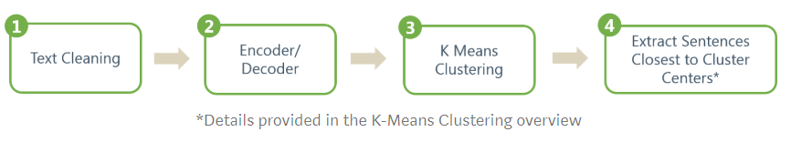

# nlp_project

* **Action Step**:
  * Research on possible datasets
  * Research on possible algorithms 
  * Implement Extractive Summary on news
  * Implement Abstractive Summary on news
  * Implement Sentiment Analysis on news 

## Tools 

* **Possible Datasets**
  * [CNN and Daily Mail](https://github.com/abisee/cnn-dailymail)
  * [Amazon Fine Food reviews](https://www.kaggle.com/snap/amazon-fine-food-reviews#Reviews.csv)
  * [XSum Dataset](https://github.com/EdinburghNLP/XSum)
 
* **Possible Libraries**
  * [SpaCy](https://spacy.io/)
  * [keras](https://www.tensorflow.org/guide/keras)
  * [Gensim](https://radimrehurek.com/gensim/)
  * [PyTorch](https://pytorch.org/) 

## Algorithms 

In the field of text summarization, there are mainly two ways to do so, namely Extractive and Abstractive Approach.

### 1. Extractive Approach 

* Retrieve the most relevant sentences or words from the input text and combine them together as the summary. Therefore, the output summary may come from the exact wordings from the input text.

#### TextRank

TextRank is based on the famous PageRank algorithm which has been deployed in the Google search enigne. The algorithm is built on the idea of majority voting, "The webpage which is linked by other webpages is important, but the webpage which is linked by many other linked webpages is more important".  The links between the webpages can be expressed by a matrix , and the matrix will be converted as a transition probability matrix.  By using the iteration formula, the weights of each node (webpage) can be determined accordingly.

In TextRank, we will regard each sentences in the documents as the node. For the matrix formualtion, the sentence similarity will be used in filling the entries in the matrix. After carrying out the iterative process, sentence with highest weighting will be the summary.  The sentence similarity can be computed in many different ways, in the original paper, it uses the overlapping words frequency between two sentences as the similarity.  Also, the similarity can be obtained by word embedding method as well.

Reference paper: 
[TextRank: Brining Order into Texts](https://web.eecs.umich.edu/~mihalcea/papers/mihalcea.emnlp04.pdf)

#### Latent Semantic Analysis 

Latent Semantic Analysis (LSA) is widely used for topic modeling tasks. It is a statisitcal method in extracting the contextual meaning of words and the similarity of sentences in an unsupervised way. LSA is based on the method of Singular Value Decomposition (SVD) to identify the relationship between terms and sentences.

In the text summarization task, LSA can be used to detect the topic. It will detect the topic of the whole document, followed by evaluating each sentence by what kind of topics are included. The sentence which obtain the highest score in the topic as the document will be the summary.

Reference paper:
[Text Summarization using Latent Semantic Analysis](https://www.researchgate.net/publication/220195824_Text_summarization_using_Latent_Semantic_Analysis)

#### Unsupervised learning with skip-thought vectors 

The method of skip-thought vectors is pretty much like word embedding, but it is in the form of sentence-to-vector (sent2vec). In generating the skip-thought vectors, Encoder Network and Decoder Network are used.

##### 1. Encoder Network
The encoder network is a typical RNN which will generate a certain length vector representation H(i) for each sentence S(i). The vector representation will be passed to the decoder network.

##### 2. Decoder Network
In the decoder network, it will take the output vector from the encoder network as the input.  By using this input H(i), the network will tries to generate the neighbor sentences S(i+1) and S(i-1). By maxmimzing the likelihood in predicting the neighbor sentences, the network will update the coefficient of the sentence vectors in each training.  The learned coefficient will be the representation of each vector. 

##### 3. K-means clustering 
After learning the vector representations of each sentences, a clustering algorithm will be carried out in grouping the sentences according to the meaning respectively.  After carrying out the clustering, the sentences which are closest to center point of each cluster are considered to be important sentences.    

### 2. Abstractive Approach 
